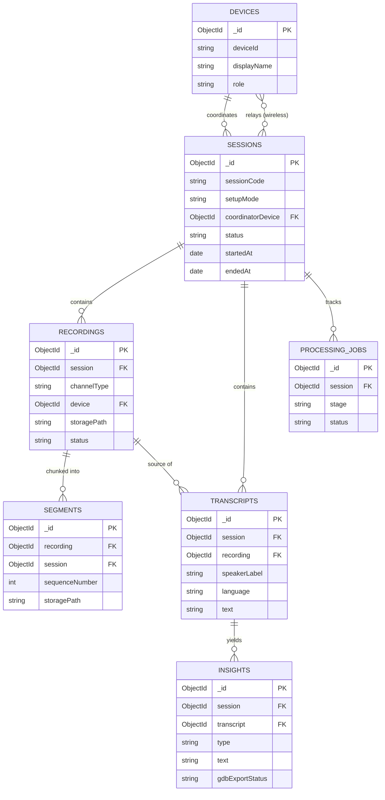

# Audio Outreach System — MongoDB Schema

**Database:** MongoDB Atlas (cloud, reachable during live sessions)
**Audio storage:** Not in MongoDB — only file paths/URLs are stored; raw audio lives on disk or object storage (e.g. S3/GCS)
**Auth:** None — Coordinators and Organizers are tracked as lightweight `Device` documents (name + generated device ID), no login/passwords

This document defines seven collections, their relationships, indexing strategy, write patterns, and example queries. It maps directly onto the data entities in Section 3.3.1 of the SRS, plus one operational addition (`ProcessingJob`, explained below).

---

## 1. Entity-relationship overview



**Why `Segment` is its own collection, not an embedded array on `Recording`:** during a Wired session with N microphones, or a Wireless session with N relays, all N channels write a new segment roughly every 10 minutes, concurrently. Embedding segments in `Recording` would mean every write contends for the same parent document and risks hitting the 16MB document cap on long sessions. A separate collection lets each channel's writer insert independently.

**Why `ProcessingJob` exists, even though it's not in the SRS's Section 3.3.1 data entities:** the SRS explicitly defers mid-pipeline failure handling (Section 3.3.3). Deferring the *handling* doesn't mean the *visibility* should be deferred too — without some record of which stage a session is stuck on, debugging a failed session means grepping logs. This collection is cheap to maintain and gives you a queryable pipeline status per session.

---

## 2. Collections

### 2.1 `devices`

Identity record for a Coordinator's laptop or an Organizer's phone. No auth — just a generated ID and a display name.

| Field | Type | Notes |
|---|---|---|
| `_id` | ObjectId | |
| `deviceId` | String | unique, generated client-side (UUID) and persisted locally |
| `displayName` | String | e.g. "Rajesh (Coordinator)", "Simran's phone" |
| `role` | String enum | `coordinator` \| `organizer` |
| `lastSeenAt` | Date | updated on connect |
| `createdAt` / `updatedAt` | Date | auto |

**Indexes:** `{ deviceId: 1 }` unique · `{ role: 1 }`

### 2.2 `sessions`

Root document for one outreach event. Three `setupMode` values are supported: `wired` and `wireless` for live-recorded sessions, and `manual` for archival imports — an existing audio file or folder submitted through a GUI form rather than captured live.

| Field | Type | Notes |
|---|---|---|
| `_id` | ObjectId | |
| `sessionCode` | String | unique, human-readable, e.g. `2026-07-09-ROPAR-01` |
| `setupMode` | String enum | `wired` \| `wireless` \| `manual` |
| `coordinatorDevice` | ObjectId → `devices` | required for `wired`/`wireless`; **left null for `manual`** — no live Device ever operated an archival import |
| `relayDevices` | [ObjectId → `devices`] | wireless only |
| `location.name` | String | village/block name, optional |
| `location.point` | GeoJSON Point | optional, `[lng, lat]` |
| `archivalMeta` | Object | populated only when `setupMode: manual` — see below |
| `status` | String enum | `configuring` → `recording` → `ended` → `processing` → `completed` \| `failed` |
| `startedAt` / `endedAt` | Date | |
| `createdAt` / `updatedAt` | Date | auto |

**`archivalMeta` sub-document** (manual imports only):

| Field | Type | Notes |
|---|---|---|
| `village` | String | |
| `district` | String | |
| `block` | String | |
| `reportingManager` | String | **free text, not a Device reference.** This is an organizational role attached to the report for accountability purposes — a person who may never have opened the app. It is a different concept from `coordinatorDevice` and must not be coerced into that field, even though the CLI's flag is confusingly named `--coordinator`. |
| `language` | String | passed to the CLI as `--language`; **required by the CLI with no default** — the import form must block submission without it, unlike `requestedDate` below |
| `requestedDate` | Date | passed as `--date`; CLI defaults to the current date if omitted, so this may be left blank |
| `model` | String enum | `performance` \| `efficient` — passed as `--model` |
| `sourcePath` | String | the selected file or folder path on the Coordinator's machine |
| `importKind` | String enum | `file` \| `folder` — determines whether `process-file` or `process-folder` is invoked |

**Indexes:** `{ coordinatorDevice: 1, startedAt: -1 }` (sparse) · `{ status: 1 }` · `{ setupMode: 1 }` · `{ "location.point": "2dsphere" }` (sparse)

### 2.3 `recordings`

One audio stream per session — the merged `combined` output, or one `individual` channel per mic/relay.

| Field | Type | Notes |
|---|---|---|
| `session` | ObjectId → `sessions` | |
| `channelType` | String enum | `combined` \| `individual` |
| `device` | ObjectId → `devices` | null for `combined` |
| `channelLabel` | String | e.g. `mic_1`, `relay_3`, `combined` |
| `storagePath` | String | path/URL of the finalized merged file |
| `durationSeconds` | Number | |
| `segmentCount` | Number | |
| `status` | String enum | `recording` → `finalized` \| `merged` \| `failed` |

**Indexes:** `{ session: 1, channelType: 1 }` · `{ session: 1, device: 1 }`

### 2.4 `segments`

A ~10-minute chunk of a recording, written live during the session.

| Field | Type | Notes |
|---|---|---|
| `recording` | ObjectId → `recordings` | |
| `session` | ObjectId → `sessions` | denormalized, avoids a join for session-wide segment queries |
| `sequenceNumber` | Number | order within the recording |
| `storagePath` | String | |
| `durationSeconds` | Number | |
| `startedAt` / `endedAt` | Date | |

**Indexes:** `{ recording: 1, sequenceNumber: 1 }` unique · `{ session: 1, startedAt: 1 }`

### 2.5 `transcripts`

One diarized, transcribed speaker turn.

| Field | Type | Notes |
|---|---|---|
| `session` | ObjectId → `sessions` | |
| `recording` | ObjectId → `recordings` | source channel |
| `speakerLabel` | String | diarization output, e.g. `SPEAKER_00` |
| `language` | String | default `pa-Guru` (Punjabi, Gurmukhi script) |
| `startTimeSeconds` / `endTimeSeconds` | Number | offset within the session |
| `text` | String | transcribed text |
| `asrConfidence` | Number \| null | 0–1 |

**Indexes:** `{ session: 1 }` · `{ session: 1, speakerLabel: 1 }` · text index on `text`

### 2.6 `insights`

A structured query, concern, or recommendation extracted from a transcript. **This is the collection the GDB consumes.**

| Field | Type | Notes |
|---|---|---|
| `session` | ObjectId → `sessions` | |
| `transcript` | ObjectId → `transcripts` | |
| `type` | String enum | `query` \| `concern` \| `recommendation` |
| `text` | String | |
| `category` | String \| null | free-form taxonomy tag, e.g. `irrigation` |
| `speakerLabel` | String | denormalized from transcript |
| `confidence` | Number \| null | LLM extraction confidence, 0–1 |
| `gdbExportStatus` | String enum | `pending` → `exported` \| `failed` |
| `gdbExportedAt` | Date \| null | |

**Indexes:** `{ session: 1 }` · `{ type: 1 }` · `{ gdbExportStatus: 1 }` · `{ category: 1 }` · text index on `text`

### 2.7 `processing_jobs`

Per-stage pipeline status for a session (operational addition, see rationale above).

| Field | Type | Notes |
|---|---|---|
| `session` | ObjectId → `sessions` | |
| `stage` | String enum | `ingestion` → `resampling` → `noise_suppression` → `diarization` → `splitting` → `transcription` → `insight_generation` → `gdb_export` |
| `status` | String enum | `pending` \| `running` \| `completed` \| `failed` |
| `startedAt` / `completedAt` | Date | |
| `errorMessage` | String \| null | |
| `attemptCount` | Number | |

**Indexes:** `{ session: 1, stage: 1 }` unique · `{ status: 1 }`

---

## 3. Write patterns

**During a live session (Coordinator online, cloud-reachable):**
1. `Configure Session` → insert `Session` (`status: configuring`), insert/upsert `Device` for the coordinator.
2. `Record Wired/Wireless Session` → insert one `Recording` per channel (`status: recording`); update `Session.status = recording`.
3. Every ~10 minutes → insert a `Segment` document per channel and `$inc` the parent `Recording.segmentCount`. This is a small, independent write per channel — no lock contention across channels.
4. `Join as Relay Microphone` → upsert `Device` (role `organizer`), `$addToSet` its ID into `Session.relayDevices`.
5. `End Session` → finalize the last `Segment` per recording, set each `Recording.status = finalized`, set `storagePath` on the merged recording, set `Session.status = ended`, `endedAt = now`.

**Post-processing (offline, triggered on `Session.status = ended`):**
1. Insert one `ProcessingJob` per stage (`status: pending`).
2. As the pipeline runs, flip each job to `running` → `completed`/`failed`, updating `startedAt`/`completedAt`.
3. Insert `Transcript` documents per diarized speaker turn.
4. Insert `Insight` documents per extracted query/concern/recommendation, linked to their source `Transcript`.
5. `gdb_export` stage reads all `Insight` docs with `gdbExportStatus: pending` for the session, pushes them to the GDB, and flips each to `exported` (or `failed`, for retry).
6. Set `Session.status = completed` once all jobs succeed (or `failed` if any stage fails terminally).

---

**Manual/archival import (triggered from the GUI import form, not a live session):**
1. Coordinator selects a file or folder and fills the form (`village`, `district`, `block`, `reportingManager`, `language` [required], `requestedDate` [optional], `model`).
2. Insert a `Session` (`setupMode: manual`, `coordinatorDevice: null`, `archivalMeta` populated from the form, `status: processing`).
3. Insert one `ProcessingJob` per pipeline stage, same as the live-session path.
4. Invoke `process-file` or `process-folder` (per `archivalMeta.importKind`) with the form's values passed through as CLI flags, plus `--input` set to `archivalMeta.sourcePath`.
5. From here on, identical to the live-session pipeline: `Transcript` and `Insight` documents are created, `Session.status` becomes `completed`, and the session appears in the results viewer exactly like a wired/wireless one — the only visible difference is `setupMode: manual` and the presence of `archivalMeta`.

## 4. Example queries

**All pending insights ready for GDB export:**
```js
db.insights.find({ gdbExportStatus: "pending" }).sort({ createdAt: 1 });
```

**Full pipeline status for a session:**
```js
db.processing_jobs.find({ session: sessionId }).sort({ stage: 1 });
```

**All insights for a session, joined with their source transcript text:**
```js
db.insights.aggregate([
  { $match: { session: sessionId } },
  {
    $lookup: {
      from: "transcripts",
      localField: "transcript",
      foreignField: "_id",
      as: "sourceTranscript",
    },
  },
  { $unwind: "$sourceTranscript" },
  {
    $project: {
      type: 1,
      text: 1,
      category: 1,
      "sourceTranscript.text": 1,
      "sourceTranscript.speakerLabel": 1,
    },
  },
]);
```

**Search insights by keyword (uses the text index):**
```js
db.insights.find({ $text: { $search: "irrigation pump" } });
```

**Sessions still stuck in processing, with their failed stage:**
```js
db.sessions.aggregate([
  { $match: { status: "processing" } },
  {
    $lookup: {
      from: "processing_jobs",
      let: { sid: "$_id" },
      pipeline: [
        { $match: { $expr: { $and: [{ $eq: ["$session", "$$sid"] }, { $eq: ["$status", "failed"] }] } } },
      ],
      as: "failedJobs",
    },
  },
  { $match: { "failedJobs.0": { $exists: true } } },
]);
```

---

## 5. Notes and open items

- **Validation:** Mongoose schema validation (types, enums, required fields) is the primary guard. If stricter guarantees are needed at the DB layer itself (e.g. protecting against writes from a future non-Mongoose script), add MongoDB `$jsonSchema` collection validators mirroring these Mongoose schemas — not included here to avoid duplicating validation logic in two places until it's actually needed.
- **Retention:** No TTL/archival policy is defined yet. Raw audio and transcripts likely need to be retained indefinitely for a research/outreach program, but this should be an explicit decision, not a default.
- **Multi-speaker-per-mic blending:** per the SRS's Open Design Items (3.3.3), a single relay mic can currently pick up multiple farmers. Until that's resolved, `Transcript.speakerLabel` reflects diarization output only — it is not a farmer identity, and `Insight.speakerLabel` inherits that same limitation.
- **Scaling:** at expected outreach-session volumes (segments every 10 minutes, one insight collection queried by the GDB), a single Atlas replica set is sufficient — no sharding needed at this stage.
