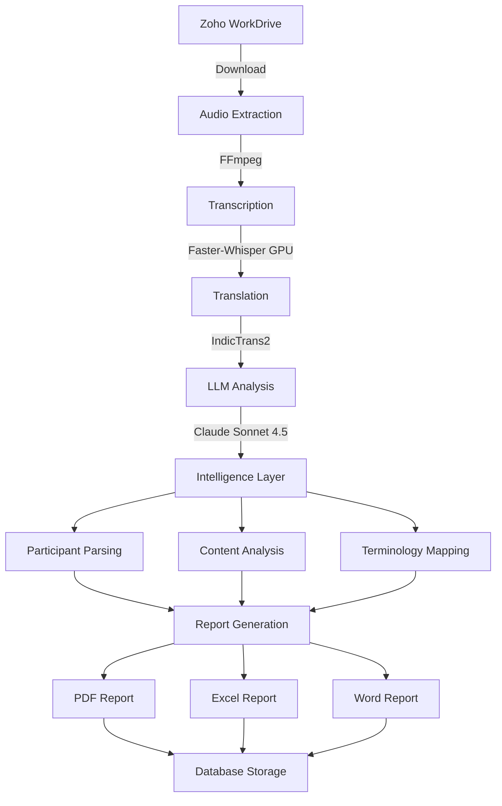

# Modifications for The current Pipeline for streamlining towards [outreach_stt](https://github.com/vicharanashala/outreach_stt)  

1. Transcription Model to be changed to gurmukhi finetuned turbo.  
2. Report Generation Model to be changed to Gemini API (not likely for Gemma 12B).  
3. Transliteration Model needs to be tested yet.  

## Outreach Dashboard Pipeline

Automated pipeline for processing farmer interaction recordings from Zoho WorkDrive. Handles audio extraction, transcription, translation, AI-powered analysis, and comprehensive report generation.

### 🚀 Key Features

- **🎤 Multi-Language Support**: Transcription (Whisper) + Translation (IndicTrans2) for Punjabi/Hindi to English
- **🧠 AI-Powered Analysis**: Claude Sonnet 4.5 for intelligent content extraction and summarization
- **📊 Comprehensive Reports**: Auto-generated PDF, Excel, and Word reports with:
  - Transliterated names and locations (Punjabi → English)
  - Participant details with smart capitalization
  - Key challenges and farmer questions
  - Crop disease terminology mapping (dialect → scientific names)
  - LLM-generated summaries and conclusions
- **⚡ GPU Acceleration**: Faster processing with CUDA support for Whisper & IndicTrans2
- **🔄 Batch Processing**: Merge multiple recordings and analyze as single interaction
- **☁️ Zoho Integration**: Automatic sync and metadata extraction from WorkDrive

### 📋 Prerequisites

- **Python**: 3.12+
- **FFmpeg**: For audio/video processing
- **GPU** (Optional): NVIDIA GPU with CUDA for faster transcription/translation
- **MongoDB**: For data storage
- **API Keys**: Anthropic (Claude), Zoho WorkDrive

### 🛠️ Installation

#### 1. Clone and Setup Environment
```bash
cd /path/to/project
python3 -m venv venv
source venv/bin/activate  # On Windows: venv\Scripts\activate
pip install -r requirements.txt
```

#### 2. Install FFmpeg
```bash
# Ubuntu/Debian
sudo apt-get install ffmpeg

# macOS
brew install ffmpeg

# Windows
# Download from https://ffmpeg.org/download.html
```

#### 3. Configure Environment Variables
```bash
cp .env.example .env
# Edit .env with your API keys and configuration
```

**Required `.env` variables:**
```bash
# Anthropic API (for Claude)
ANTHROPIC_API_KEY=sk-ant-api03-...

# MongoDB
MONGODB_URI=mongodb://localhost:27017
MONGODB_DB_NAME=outreach_reports

# Zoho WorkDrive API
ZOHO_CLIENT_ID=your_client_id
ZOHO_CLIENT_SECRET=your_client_secret
ZOHO_REFRESH_TOKEN=your_refresh_token

# Processing Settings
USE_GPU=true                    # Set to false if no GPU available
WHISPER_MODEL=large-v3         # Options: tiny, base, small, medium, large-v3
DEVICE=cuda                     # Options: cuda, cpu
```

### 📂 Project Structure

```
Outreach Dashboard/
├── config.py                   # Central configuration
├── requirements.txt            # Python dependencies
├── .env                        # Environment variables (gitignored)
├── .env.example               # Template for environment setup
├── README.md                   # This file
│
├── src/                        # Main application code
│   ├── main.py                 # CLI entry point
│   ├── pipeline.py             # Pipeline orchestrator
│   ├── core/                   # Core utilities
│   │   ├── database.py         # MongoDB & file storage
│   │   ├── storage.py          # File management
│   │   └── utils.py            # Logging & validation
│   └── modules/                # Feature modules
│       ├── processing.py       # Audio extraction, transcription, translation
│       ├── analysis.py         # LLM analysis, transliteration, participants
│       ├── reports.py          # PDF/Excel/Word report generation
│       └── zoho.py             # Zoho WorkDrive integration
│
├── scripts/                    # Utility scripts
│   ├── utils/
│   │   ├── inspect_record.py   # Database record inspection
│   │   └── regenerate_report.py # Report regeneration utility
│   └── README.md               # Scripts documentation
│
├── data/                       # Generated data (gitignored)
│   ├── audio/                  # Extracted audio files
│   ├── reports/                # Generated reports by interaction ID
│   └── temp/                   # Temporary processing files
│
├── logs/                       # Application logs (gitignored)
│   └── pipeline.log            # Main pipeline log
│
├── assets/                     # Static assets
│   └── fonts/                  # Custom fonts for PDF generation
│
└── venv/                       # Virtual environment (gitignored)
```

### 🎯 Usage

#### Process Single Local File
Process a single audio/video file with custom metadata:

```bash
python -m src.main process-file /path/to/audio.mp3 \
  --village "Railon Kalan" \
  --district "Rupnagar" \
  --block "Chamkaur Sahib" \
  --sarpanch "Prakash Singh"
```

#### Merge & Process Zoho Folder
Download all recordings from a Zoho folder, merge them, and generate one comprehensive report:

```bash
python -m src.main process-merge <FOLDER_ID> \
  --village "Garhi Farid" \
  --district "Rupnagar"
```

**Example:**
```bash
python -m src.main process-merge abc123xyz456 --village "Railon Kalan"
```

#### Merge & Process Local Folder
Scan all recordings from a local folder, merge them, and generate one comprehensive report:

```bash
python -m src.main process-folder /path/to/local/folder \
  --village "Garhi Farid" \
  --district "Rupnagar"
```

**Example:**
```bash
python -m src.main process-folder ./data/local_meetings/input_audios --village "Railon Kalan"
```

#### Sync Individual Files from Zoho
Process each file in a Zoho folder individually (separate reports):

```bash
python -m src.main sync <FOLDER_ID>
```

### 🔄 Pipeline Architecture



#### Processing Steps

1. **📥 Download & Validation**: Fetch from Zoho, validate format and size
2. **🎵 Audio Extraction**: Extract audio from video using FFmpeg
3. **🎤 Transcription**: GPU-accelerated Whisper transcription (Punjabi/Hindi)
4. **🌐 Translation**: IndicTrans2 translation to English
5. **🧠 AI Analysis**: Claude extracts:
   - Detailed narration and summary
   - Key challenges faced by farmers
   - Questions asked by farmers
   - Crop disease terminology (local dialect → scientific names)
6. **👥 Participant Parsing**: Extract and transliterate farmer names
7. **📝 Transliteration**: Convert all Punjabi Unicode to readable English
8. **📄 Report Generation**: Create formatted reports (PDF, Excel, Word)
9. **💾 Storage**: Save to MongoDB with file references

### 📊 Report Features

#### PDF Report Includes:
- **Metadata Table**: Date, village, sarpanch, location, participant counts
- **Narration Section**: 
  - LLM-generated summary (2-3 sentences)
  - Detailed meeting narration
- **Key Challenges**: Boxed section with numbered list
- **Farmer Questions**: Boxed section with numbered list
- **Terminology Mapping**: Table mapping local disease names to scientific names
- **Participants Details**: Simplified table with names (properly capitalized)
- **Conclusion**: LLM-generated 2-3 paragraph summary

#### Special Features:
- ✅ **Punjabi → English Transliteration**: All names and locations converted to readable English
- ✅ **Smart Capitalization**: Proper handling of surnames (Singh, Kaur, Kumar)
- ✅ **No Unicode Issues**: All text renders correctly in PDF (no black boxes)
- ✅ **Professional Formatting**: Boxed sections, optimized column widths, no text overflow

### 🔧 Troubleshooting

#### GPU Not Detected
```bash
# Check CUDA availability
python -c "import torch; print(torch.cuda.is_available())"

# If False, set USE_GPU=false in .env
```

#### MongoDB Connection Failed
```bash
# Check MongoDB is running
sudo systemctl status mongod

# Start MongoDB
sudo systemctl start mongod
```

#### Zoho API Errors
```bash
# Refresh your Zoho token
# See .env.example for token generation instructions
```

#### Report Generation Issues
```bash
# Inspect a specific record
PYTHONPATH=. python scripts/utils/inspect_record.py <interaction_id>

# Regenerate report
PYTHONPATH=. venv/bin/python3 scripts/utils/regenerate_report.py
```

#### Check Logs
```bash
# View real-time logs
tail -f logs/pipeline.log

# Search for errors
grep ERROR logs/pipeline.log
```

### 📝 Development

#### Adding New Features
1. Core utilities → `src/core/`
2. Processing modules → `src/modules/`
3. Update `src/pipeline.py` to integrate new steps

#### Testing
```bash
# Test with a small audio file first
python -m src.main process-file test_audio.mp3 --village "Test Village"
```

### 📄 License

Internal project for farmer outreach analysis.

### 🤝 Support

For issues or questions, check:
1. `logs/pipeline.log` for error details
2. `scripts/README.md` for utility script usage
3. Database records using `scripts/utils/inspect_record.py`
