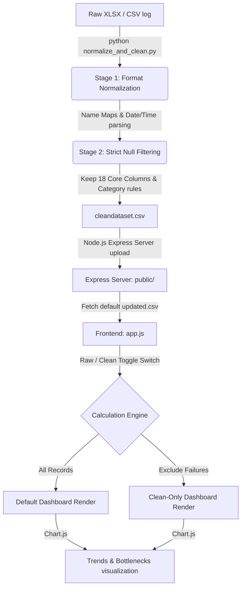

# 📐 Master Technical Blueprint & Architecture Reference

This blueprint serves as the comprehensive technical documentation for the Agri Advisory QA Test Log pipeline and Interactive Dashboard. It specifies the data processing stages, structural repairs, mathematical formulations for KPIs, and frontend code execution paths.

---

## 🗺️ System Data Flow & Architecture

The following diagram illustrates the flow of test logs through our ingestion, cleaning, and visualization layers:



---

## 🛠️ Data Normalization & Structural Repairs

### 1. Row Specific Structural Repairs
Two critical rows containing layout shifting errors and transposed cells in the raw log are corrected programmatically:
*   **Row `TL-2477` (Transposed Reviewer 1 Cells):**
    *   *Bug:* `Reviewer1 Name` contained `'11:39:47 Am'`, while `Reviewer1 Assignment Time` contained the name `'Ambika'`.
    *   *Correction:* Swapped values to place name `"Ambika"` in `Reviewer1 Name` and timestamp `"2026-06-25 11:39:47"` in `Reviewer1 Assignment Time`. Programmatically set `Reviewer1 TAT` to `0.0` (simultaneous action).
*   **Row `TL-5222` (Shifted Reviewer 4 Cells):**
    *   *Bug:* Reviewer 4 column range (Col 39-43) was shifted horizontally, displacing the reviewer's name (`'Suraiya Amin'`) and datetimes.
    *   *Correction:* Shifted cells left/right to realign `'Suraiya Amin'` into `Reviewer4 Name`, setting assignment time to `"2026-07-10 20:00:04"` and completion to `"2026-07-10 20:07:13"`, recalculating TAT as `7.13`.

### 2. Time & Date Standardization
*   **Dates:** Formatted mixed date strings (e.g. `'10.06.2026'`, `'14-06-2026'`, or spacing errors like `'12-06 -2026'`) to ISO standard `YYYY-MM-DD`.
*   **Times:** Converted decimal hours (e.g. Asked `11.0` $\rightarrow$ `11:00:00`, Received `6.52` $\rightarrow$ `06:52:00`), stripped extra characters (e.g. `'06:52:AM'` $\rightarrow$ `'06:52:00'`), and parsed 12-hour AM/PM formats (e.g. `'2:32:32 PM'`) into standard 24-hour `HH:MM:SS`.

---

## 📊 Executive KPI Formulas & Mathematical Logic

The dashboard computes four high-level metrics and three diagnostic items using standard math filters:

### 1. ACE Trust Score
Evaluates the technical correctness and attribution quality of the chatbot's responses.
*   **Formula:**
    $$\text{Trust Score} = 0.40 \cdot A_{sci} + 0.20 \cdot A_{dom} + 0.10 \cdot S_{lnk} + 0.10 \cdot E_{exp} + 0.10 \cdot Q_{trn} + 0.10 \cdot C_{chn}$$
*   **Mathematical Components:**
    *   $A_{sci}$ (**Scientific Accuracy**):
        $$A_{sci} = \frac{\sum \text{Rows where } \text{[Answer Scientifically Correct?]} = \text{"Correct"}}{N} \cdot 100$$
    *   $A_{dom}$ (**Domain Accuracy**): Calculates accuracy only on applicable subset rows:
        $$A_{dom} = \frac{\text{WeatherAcc} + \text{MandiAcc} + \text{SchemeAcc}}{3}$$
        where $\text{WeatherAcc} = \frac{\text{Correct Weather Answers}}{\text{Total Weather Qs}} \cdot 100$, etc.
    *   $S_{lnk}$ (**Source Verification**):
        $$S_{lnk} = \frac{\sum \text{Rows where } \text{[Source Links Provided?]} = \text{"Provided & Relevant"}}{N} \cdot 100$$
    *   $E_{exp}$ (**Expert Attribution**):
        $$E_{exp} = \frac{\sum \text{Rows where } \text{[Expert Displayed?]} = \text{"Yes"} \land \text{[Correct Expert?]} = \text{"Yes"}}{N} \cdot 100$$
    *   $Q_{trn}$ (**Translation Quality**):
        $$Q_{trn} = \frac{\sum \text{Rows where } \text{[Translation Quality]} \in \{\text{"Correct"}, \text{"Good"}\}}{N} \cdot 100$$
    *   $C_{chn}$ (**Cross-Channel Match**):
        $$C_{chn} = \frac{\sum \text{Rows where } \text{[WhatsApp vs Web Answer Match?]} = \text{"Yes"}}{N} \cdot 100$$

### 2. Farmer Experience (FX) Score
Evaluates response turnaround speeds, notification triggers, and user interaction mechanics.
*   **Formula:**
    $$\text{FX Score} = 0.30 \cdot S_{rsp} + 0.20 \cdot S_{sla} + 0.20 \cdot V_{io} + 0.15 \cdot Q_{trn} + 0.15 \cdot N_{exp}$$
*   **Mathematical Components:**
    *   $S_{rsp}$ (**Response Speed**): Measured using `Response Time (mins) [Auto]` (scaled $R_t$ in minutes):
        *   If $R_t \le 15\text{ mins}$, score = 100.
        *   If $R_t > 120\text{ mins}$, score = 0.
        *   Otherwise:
            $$\text{Score} = 100 - \left( \frac{R_t - 15}{120 - 15} \right) \cdot 100$$
    *   $S_{sla}$ (**SLA Compliance**):
        $$S_{sla} = \frac{\sum \text{Rows where } \text{[SLA Status]} = \text{"Within SLA"}}{N} \cdot 100$$
    *   $V_{io}$ (**Voice Quality**): Average of the four binary rates for voice functionalities:
        $$V_{io} = \frac{\text{VoiceInputWorking\%} + \text{VoiceOutputWorking\%} + \text{VoiceInputClear\%} + \text{VoiceOutputClear\%}}{4}$$
    *   $N_{exp}$ (**Notification Quality**):
        $$N_{exp} = \frac{\sum \text{Rows where } \text{[Notification Received?]} \in \{\text{"Yes"}, \text{"Time"}\} \land \text{[Same Thread?]} = \text{"Yes"} \land \text{[Correct QID?]} = \text{"Yes"}}{N} \cdot 100$$

### 3. Critical Failures Today
Counts critical system issues across the selected subset:
$$\text{Critical Failures} = \sum \text{Incorrect Answers} + \sum \text{Not Saved DB Errors} + \sum \text{Not Received Notifications} + \sum \text{Critical Bugs}$$

### 4. Release Health %
Assesses system deployment readiness by penalizing defect and data save anomalies against the pass rate.
*   **Formula:**
    $$\text{Release Health \%} = \max\left(0, \text{Pass Rate \%} - \text{Critical Defect Rate \%} - \text{Data Integrity Failure Rate \%}\right)$$
    *   where:
        $$\text{Pass Rate \%} = \frac{\text{Passed overall statuses}}{N} \cdot 100$$
        $$\text{Critical Defect Rate \%} = \frac{\text{Critical defect severities}}{N} \cdot 100$$
        $$\text{Data Integrity Failure Rate \%} = \frac{\text{Not Saved DB status or inconsistent Q-ID rows}}{N} \cdot 100$$

---

## 💻 Code Implementation Logic

### 1. Time-to-Minutes Parser (`app.js` & `normalize_and_clean.py`)
Handles parsing and standardizing raw cell values into numerical durations (minutes) to resolve `#VALUE!` Excel issues:

```javascript
function timeToMinutes(val) {
  if (!val) return null;
  val = val.toString().trim().toUpperCase();
  
  // Format 1: Decimal Float e.g. 10.52
  if (/^\d+\.\d+$/.test(val)) {
    const f = parseFloat(val);
    const hours = Math.floor(f);
    const mins = Math.round((f - hours) * 100);
    return hours * 60 + Math.min(mins, 59);
  }
  // Format 2: Standard HH:MM or HH:MM:SS
  const parts = val.split(':');
  if (parts.length >= 2) {
    const h = parseInt(parts[0], 10);
    const m = parseInt(parts[1], 10);
    return h * 60 + m;
  }
  return null;
}
```

### 2. Exclude Failures Clean Toggle Logic (`app.js`)
When the toggle switch is activated, it filters the active dataset array in memory before running calculations:

```javascript
const filtered = allRecords.filter(r => {
  if (excludeFailures) {
    const isCritical = r['Defect Severity'] === 'Critical';
    const isDbFail = r['Question Saved in DB?'] === 'Not Saved' || r['Answer Saved in DB?'] === 'Not Saved';
    const isInconsistent = r['Q-ID Consistent Across Systems?'] === 'Wrongly Identified as Duplicate';
    return !isCritical && !isDbFail && !isInconsistent;
  }
  return true;
});
```

### 3. Stage Bottleneck Avg TAT (Diagnostics)
Loops through calculated turnaround time keys for each reviewer block, aggregates them, and extracts the stage with the highest value:

```javascript
const stages = [
  { name: 'Authoring', key: 'Author TAT (mins) [Auto]' },
  { name: 'Review 1', key: 'Review1 TAT (mins) [Auto]' },
  { name: 'Review 2', key: 'Review2 TAT (mins) [Auto]' },
  { name: 'Review 3', key: 'Review3 TAT (mins) [Auto]' },
  { name: 'Review 4', key: 'Review4 TAT (mins) [Auto]' },
  { name: 'Review 5', key: 'Review5 TAT (mins) [Auto]' },
  { name: 'Moderator', key: 'Moderator TAT (mins) [Auto]' }
];

stages.forEach(stage => {
  let sum = 0, count = 0;
  filtered.forEach(r => {
    const mins = timeToMinutes(r[stage.key]);
    if (mins !== null) { sum += mins; count++; }
  });
  const avg = count ? sum / count : 0;
  if (avg > maxTatTime) {
    maxTatTime = avg;
    maxTatName = stage.name;
  }
});
```
